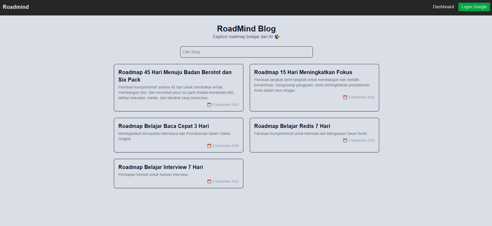

# Roadmind 🛣️🧠

Roadmind adalah aplikasi **AI Blog Planner** yang membantu menyusun konten atau roadmap harian sesuai kebutuhan.
Cukup masukkan **topik** dan **durasi (jumlah hari)**, lalu AI akan menghasilkan rencana harian lengkap, misalnya:

- Hari 1 → Belajar dasar-dasar Web Development
- Hari 2 → Mengenal HTML & CSS
- ...
- Hari 7 → Deploy project ke hosting

Proyek ini dibangun dengan **Next.js** dan **Firebase**, serta memanfaatkan **Google Generative AI** untuk pembuatan konten otomatis.

---

## ✨ Fitur

- 🔐 **Login dengan Google** via Firebase Authentication.
- 🧑‍💻 **AI Content Planner**: user input topik + durasi → AI generate roadmap harian.
- 📚 **Format Blog**: hasil tersimpan dan ditampilkan seperti artikel/blog.
- ☁️ **Realtime Storage**: data disimpan dengan Firebase.
- ⚡ **UI Modern & Responsif** dengan Next.js.

---

## 📸 Demo

<!-- **Demo Online:** [roadmind.vercel.app](https://roadmind.vercel.app) -->



## 

## 🛠️ Teknologi yang digunakan

- [Next.js](https://nextjs.org/) – React framework modern.
- [Firebase](https://firebase.google.com/) – Authentication & Database.
- [Google Generative AI](https://ai.google/) – Content generation.
- [TypeScript](https://www.typescriptlang.org/) – Strongly typed codebase.

---

## 🚀 Cara Menjalankan

1. Clone repository ini

   ```bash
   git clone https://github.com/tiedsandi/project_ai-todo.git
   cd project_ai-todo
   ```

2. buat .env.local

   ```bash
   NEXT_PUBLIC_FIREBASE_API_KEY=...
   NEXT_PUBLIC_FIREBASE_AUTH_DOMAIN=...
   NEXT_PUBLIC_FIREBASE_PROJECT_ID=...
   NEXT_PUBLIC_FIREBASE_STORAGE_BUCKET=...
   NEXT_PUBLIC_FIREBASE_MESSAGING_SENDER_ID=...
   NEXT_PUBLIC_FIREBASE_APP_ID=...
   GOOGLE_API_KEY=...
   ```

3. Install dependencies

   ```bash
   npm install
   ```

4. Tambahkan konfigurasi Firebase ke dalam file `.env.local`.
5. Jalankan aplikasi

   ```bash
   npm run dev
   ```

---

## 🌐 Project Lainnya

Cek project saya yang lain di sini 👉 [fachran-sandi.netlify.app](https://fachran-sandi.netlify.app/)

---
